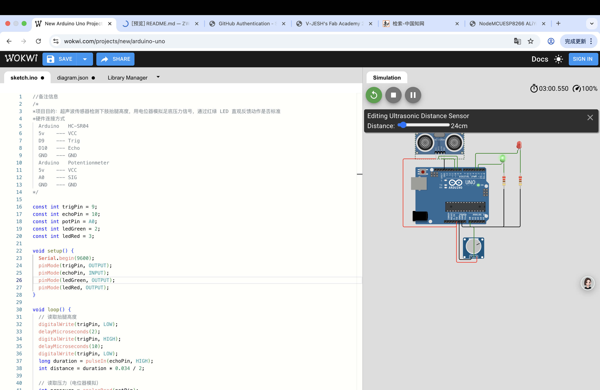
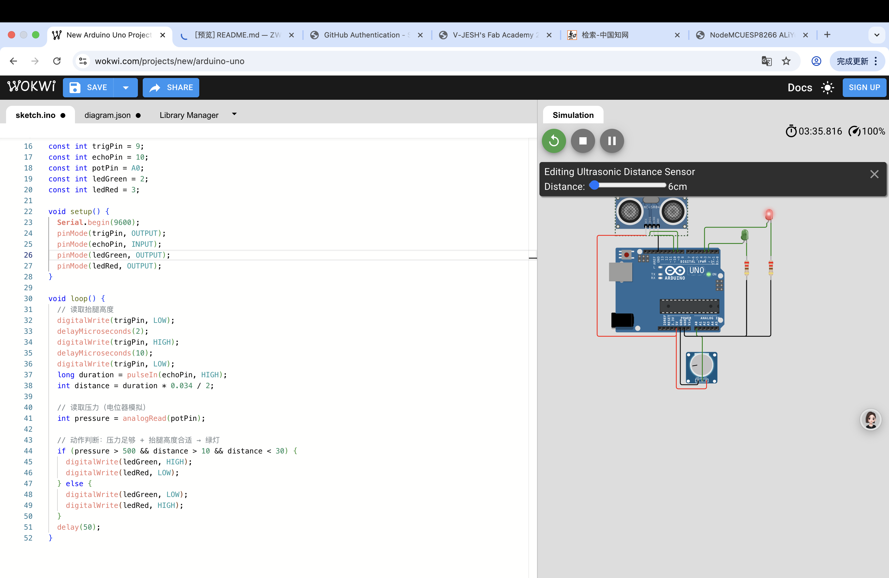

一、项目信息
项目名称：下肢康复训练智能提示器
传感器：HC-SR04 超声波、电位器（模拟足底压力）
反馈：绿灯 = 动作标准，红灯 = 需调整
用途：监测抬腿高度 + 足部负重，辅助下肢康复训练
二、Wokwi 所需元件
Arduino UNO
HC-SR04 超声波
Potentiometer（电位器，3 脚）
LED Green ×1
LED Red ×1
220Ω 电阻 ×2
面包板、导线
三、Wokwi 逐脚接线（照着接）
1. 超声波 HC-SR04
VCC → 5V
Trig → D9
Echo → D10
GND → GND
2. 电位器（模拟压力传感器）
左引脚 → 5V
中间引脚 → A0
右引脚 → GND
3. 绿灯（D2）
阳极 → D2
阴极 → 220Ω 电阻 → GND
4. 红灯（D3）
阳极 → D3
阴极 → 220Ω 电阻 → GND

//备注信息
/*
*项目目的：超声波传感器检测下肢抬腿高度，用电位器模拟足底压力信号，通过红绿 LED 直观反馈动作是否标准
*硬件连接方式 
  Arduino   HC-SR04
  5v    --- VCC
  D9    --- Trig
  D10   --- Echo
  GND   --- GND
  Arduino   Potentionmeter
  5v    --- VCC
  A0    --- SIG
  GND   --- GND
*/

const int trigPin = 9;
const int echoPin = 10;
const int potPin = A0;
const int ledGreen = 2;
const int ledRed = 3;

void setup() {
  Serial.begin(9600);
  pinMode(trigPin, OUTPUT);
  pinMode(echoPin, INPUT);
  pinMode(ledGreen, OUTPUT);
  pinMode(ledRed, OUTPUT);
}

void loop() {
  // 读取抬腿高度
  digitalWrite(trigPin, LOW);
  delayMicroseconds(2);
  digitalWrite(trigPin, HIGH);
  delayMicroseconds(10);
  digitalWrite(trigPin, LOW);
  long duration = pulseIn(echoPin, HIGH);
  int distance = duration * 0.034 / 2;

  // 读取压力（电位器模拟）
  int pressure = analogRead(potPin);

  // 动作判断：压力足够 + 抬腿高度合适 → 绿灯
  if (pressure > 500 && distance > 10 && distance < 30) {
    digitalWrite(ledGreen, HIGH);
    digitalWrite(ledRed, LOW);
  } else {
    digitalWrite(ledGreen, LOW);
    digitalWrite(ledRed, HIGH);
  }
  delay(50);
}